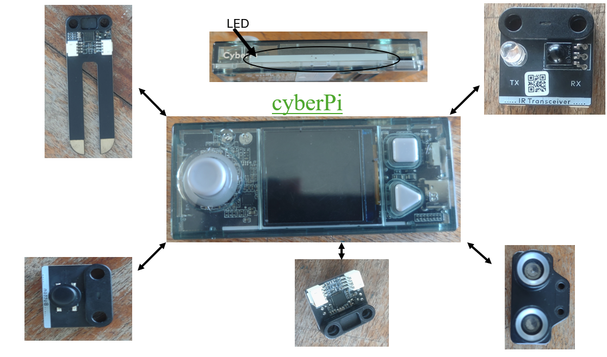

# Journal —jeudi du 27 août 2026 (rédigé par : ibrahim TCHAMOUZA)

## Fait aujourd'hui
- Utilisation de **xTool** pour découper une carte de visite avec la machine **P3**.
- Utilisation de **mBlock** pour allumer les **LED**, ainsi que découverte de plusieurs **capteurs** et du **CyberPi** , .
- * Utilisation du logiciel **Bambu Studio** pour transformer un fichier **STL** en fichier **G-code**.
 

## Appris
- Comment utiliser **mBlock** pour actionner certains composants, tels que les **capteurs d’humidité, de température,de lumiére ....**, et un microcontrôleur appelé **CyberPi**.
- Comment utiliser **Bambu Studio** pour préparer un fichier **imprimable en 3D**.
 

## Raté, puis corrigé

- Comment arranger les images importées afin de les graver avec le **laser**.
- La maîtrise des **logiciels de travail** permettant d’obtenir un résultat propre et de qualité, sous forme d’**objets imprimés et modélisés**.

## Décidé

- Continuer à nous exercer avec les logiciels à la maison.

## À faire demain

- Continuer les modules plus en profondeur avec les formateurs.
