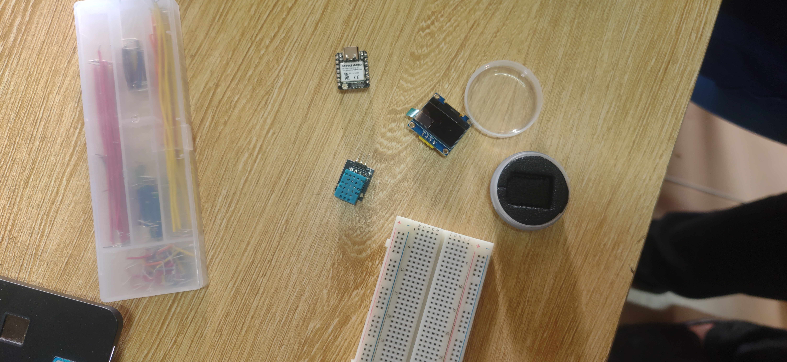

# Journal — Samedi 05 septembre 2026 (Rédigé par : Ibrahim TCHAMOUZA)

## Fait aujourd’hui

- Un TP sur **Smart Weather**, une station météorologique réalisée à l’aide de composants tels qu’un **capteur d’humidité et de température**, un **écran OLED** et un **ESP32-S3**. .jpg>) 

## Appris

- Comment effectuer les **connexions sur une breadboard** et comment connecter les **broches (pins) de chaque composant** afin d’obtenir le résultat souhaité.

- Utilisation de l’éditeur de code **Thonny** pour exécuter le programme.

## Raté, puis corrigé

- Une erreur de connexion des broches a été constatée, mais j’ai finalement trouvé la bonne manière d’effectuer les **branchements sur la breadboard**.

## Décidé

- Continuer à **m’exercer sur les différents logiciels**.

## À faire demain

- Continuer les différents **modules de formation**.
