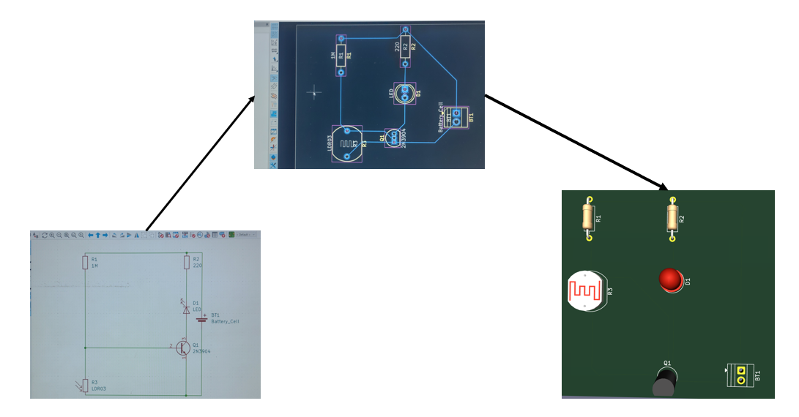

# Journal — Lundi 07 septembre 2026 (Rédigé par : Ibrahim TCHAMOUZA)

## Fait aujourd’hui

- Cours sur l’initiation au PCB.Circuit (interrupteur crépusculaire) réalisé. 

## Appris

- Comment schématiser les circuits avec le logiciel **KiCad**.
- Comment ajouter les références de chaque composant.
- Comment visualiser le circuit en **3D**.

## Raté, puis corrigé

- J’ai rencontré des difficultés lors de la construction du circuit, notamment pour réaliser les branchements entre les différents composants. J’ai finalement réussi à comprendre comment effectuer les branchements correctement.

## Décidé

- Continuer à **m’exercer sur les différents logiciels**.

## À faire demain

- Continuer les différents **modules de formation**.
