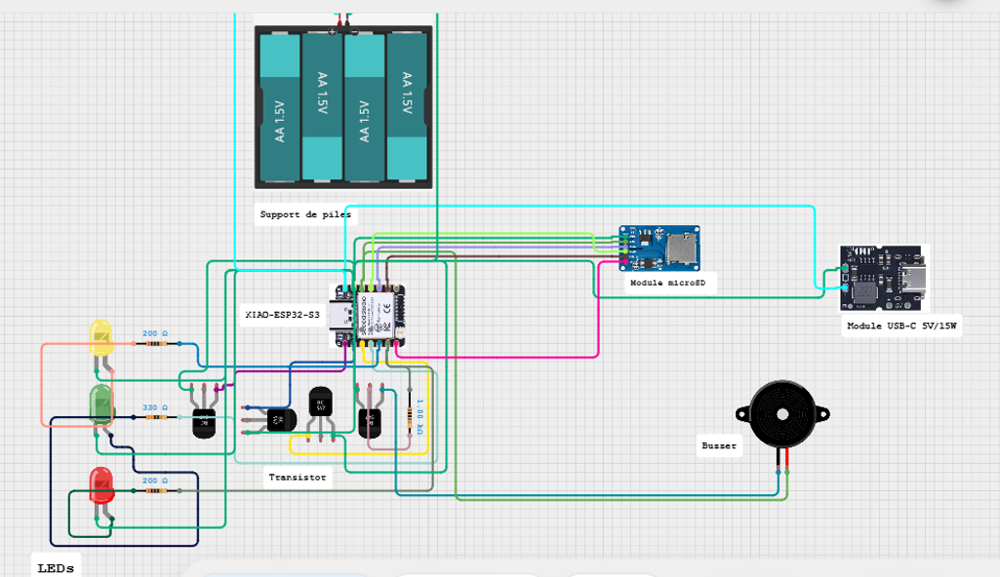

# Journal — Mardi 08 septembre 2026 (Rédigé par : Ibrahim TCHAMOUZA)

## Fait aujourd’hui

- Cours sur l’usinage CNC.
- Organisation de notre projet en réalisant un circuit et un code pour le piloter.

## Appris

- Comment réaliser un circuit avancé de test avec un code.
- Comment utiliser Fusion 360 pour préparer un fraisage CNC en modifiant les paramètres dans le logiciel afin de réussir l’usinage.

## Raté, puis corrigé

- La réalisation du circuit de notre projet n’a pas été facile pour nous, mais avec l’aide des formateurs, nous avons pu trouver une solution pour réaliser le circuit.
- La modification des paramètres pour l’usinage était compliquée. Cependant, nous avons finalement trouvé un moyen d’effectuer ces modifications correctement.

## Décidé

- Continuer à **m’exercer sur les différents logiciels**.

## À faire demain

- Continuer les différents **modules de formation**.

