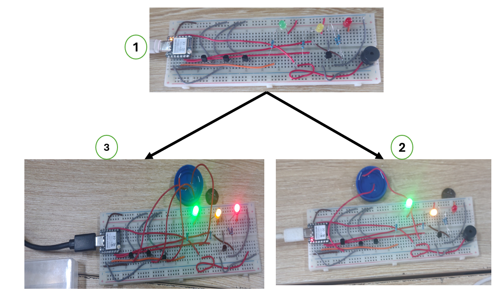

# Journal — Jeudi 10 septembre 2026 (Rédigé par : Ibrahim TCHAMOUZA)

## Fait aujourd’hui

- Nous avons travaillé sur notre projet de détecteur de niveau d’eau.

## Appris

- Nous avons appris à tester le montage du circuit réalisé pour détecter le niveau d’eau à trois niveaux différents.
- Nous avons également appris à programmer le système afin de commander les LED en fonction du niveau d’eau détecté :

  **Niveau 1 : LED verte**
  **Niveau 2 : LED jaune**
  **Niveau 3 : LED rouge**

## Raté, puis corrigé

- Au début des tests, en utilisant **Thonny** comme éditeur de code, nous avons rencontré des difficultés dans la programmation du système. Après avoir modifié et corrigé le code, nous avons réussi à faire fonctionner les LED correspondant aux différents niveaux d’eau : **vert pour le niveau 1, jaune pour le niveau 2 et rouge pour le niveau 3**.

## Décidé

- Continuer à perfectionner le code et à améliorer le fonctionnement du système pour le **jour 2 du projet**.

## À faire demain

- Poursuivre les différentes activités liées au projet.
- Continuer les tests et les améliorations du système de détection du niveau d’eau.
