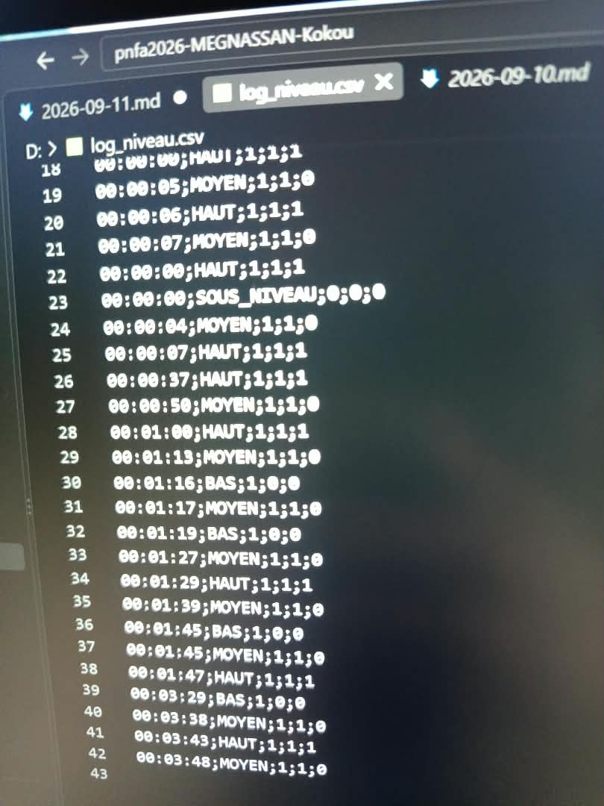

# Journal — Lundi 14 septembre 2026 (Rédigé par : Ibrahim TCHAMOUZA)

## Fait aujourd’hui

- Amélioration de la boîte modélisée, du montage électronique et du code du système de détection du niveau d’eau avec .

## Appris

- comment le microcontrôleur interprète et exécute le code qui lui est transmis.
- le lien entre le programme, le microcontrôleur et le fonctionnement des différents composants du système.
- comment enregistre les donnees sur une carte mémoire 

## Raté, puis corrigé

- Quelques difficultés au niveau de l'amélioration du code, mais après plusieurs corrections et ajustements, le programme a finalement fonctionné correctement.

## Décidé

- Continuer à perfectionner le code et à améliorer le fonctionnement général du système pour le **jour 4 du projet**.

## À faire demain

- Poursuivre les différentes activités liées au projet.
- Continuer les tests et les améliorations du **système de détection du niveau d’eau**.
- Vérifier l’intégration du PCB, du support des piles et des différents composants dans la boîte.
- Effectuer des tests complets du système afin de vérifier son bon fonctionnement.
