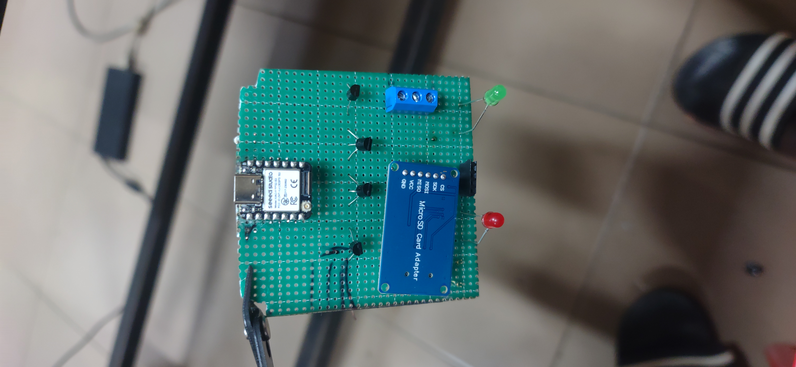
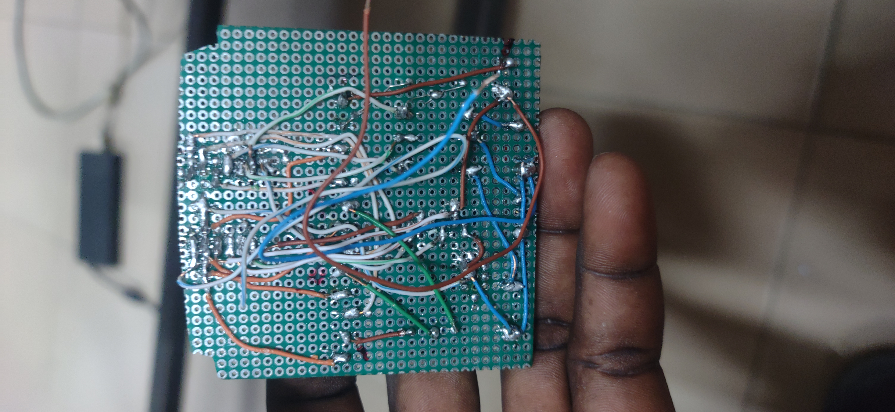

# Journal — Mercredi 16 septembre 2026 (Rédigé par : Ibrahim TCHAMOUZA)

## Fait aujourd’hui

- Amélioration de la boîte modélisée en apportant les ajustements nécessaires pour finaliser sa conception.
- Poursuite de la connexion et de l’organisation des différents composants sur la plaquette perforée. . 
- Vérification de la disposition des composants afin de faciliter leur intégration dans la boîte modélisée.

## Appris

- J’ai appris à mieux positionner et disposer les composants à souder afin qu’ils puissent être correctement intégrés dans la boîte modélisée.
- J’ai également appris qu’il est important de prévoir l’emplacement de chaque composant avant la soudure afin d’éviter les problèmes d’encombrement et de faciliter le montage final.

## Raté, puis corrigé

- Nous avons rencontré quelques difficultés lors de l’amélioration de la boîte finale et de la connexion des composants sur la plaquette perforée. Après plusieurs vérifications, corrections et ajustements, nous avons réussi à améliorer la disposition des composants et à poursuivre correctement le montage.

## Décidé

- Continuer à travailler sur l’architecture générale du projet afin d’assurer une bonne intégration de la plaquette, du support des piles et des différents composants dans la boîte.
- Vérifier progressivement chaque élément du montage avant de procéder aux tests complets du système.

## À faire demain

- Poursuivre les différentes activités liées au projet.
- Vérifier l’intégration de la plaquette perforée, du support des piles et des différents composants dans la boîte.
- Effectuer des tests complets du système afin de vérifier son bon fonctionnement.
- Apporter les derniers ajustements nécessaires à la boîte et au montage.
- Vérifier que tous les composants sont correctement connectés et solidement fixés avant la mise en fonctionnement du système.
