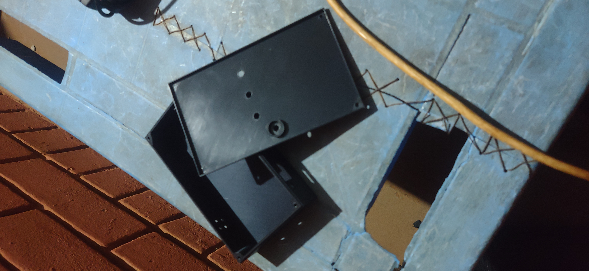
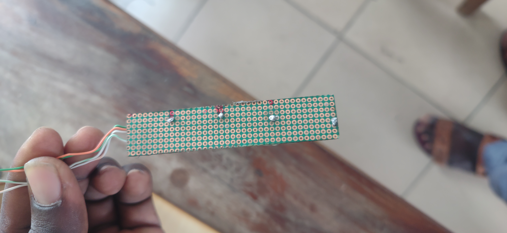
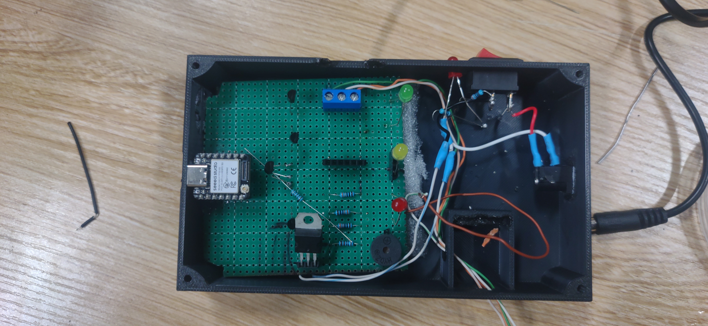
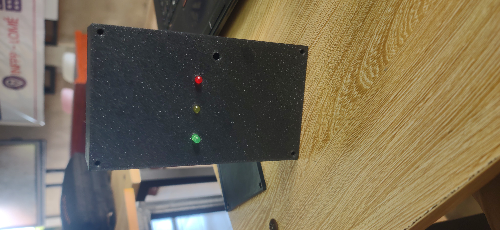
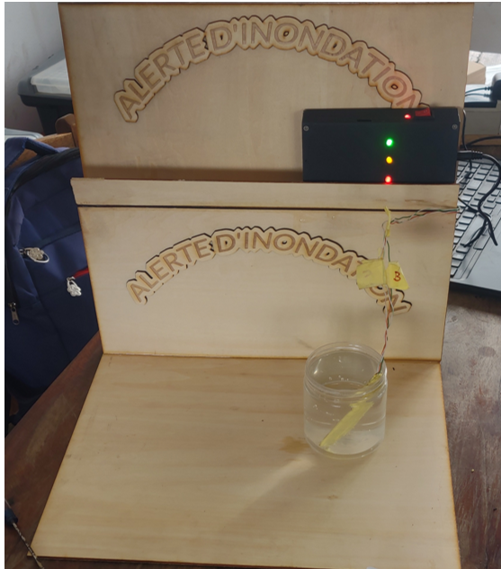

# Journal — Jeudi 17 septembre 2026 (Rédigé par : Ibrahim TCHAMOUZA)

## Fait aujourd’hui

- Finalisation du projet et préparation de la présentation PowerPoint.
,,,,
## Appris

- Assemblage et intégration de l’ensemble du système, du boîtier jusqu’aux tests finaux.

## Raté, puis corrigé

- Au début, le système rencontrait quelques problèmes de fonctionnement. Après plusieurs modifications, nous avons réussi à résoudre le problème.

## Décidé

- Approfondir ma compréhension du fonctionnement du système.

## À faire demain

- Venir présenter le projet.